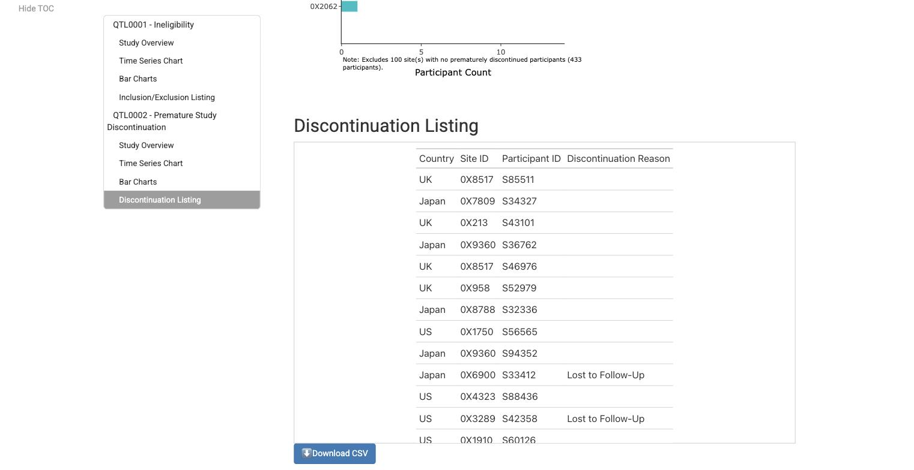
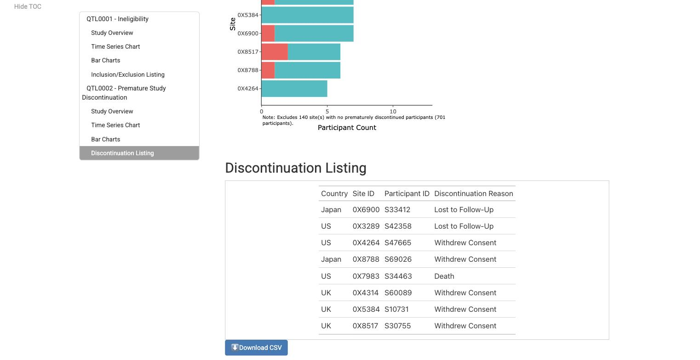
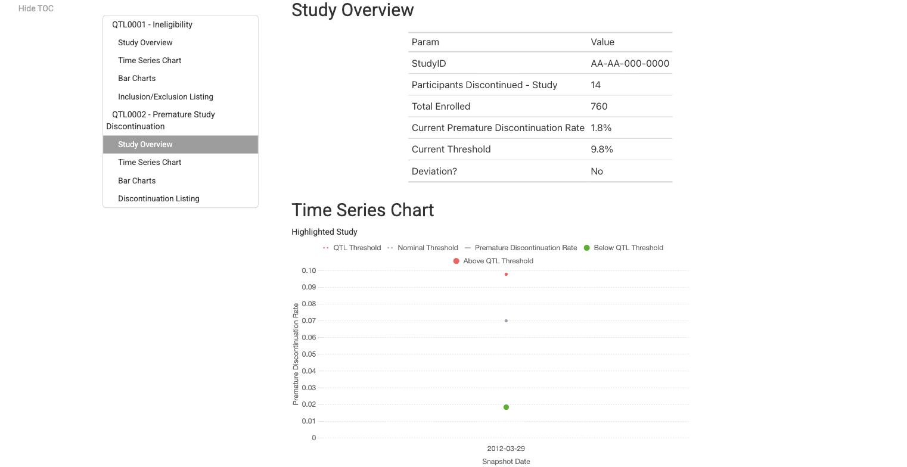

<!-- STATUS: Drafted on 2026-07-29 06:15 EDT -->
<!-- GITHUB_PROPERTIES: Repo: Gilead-BioStats/gsm.qtl, Labels: bug, Assignee: @jwildfire -->
<!-- NOT POSTED: agents have no write access to Gilead-BioStats. @jwildfire files. -->

# QTL0002 discontinuation listing and bar charts include completed participants

`inst/workflow/4_modules/report_qtl.yaml`, line 55.

## Summary

The `compreas` fill in the report module only tests `is.na()`. In every dataset in the ecosystem a participant who completed the study has `compreas = ""`, not `NA`, so the fill never fires for them. The `WHERE compreas != 'Completed/Ongoing'` filter on the next step then keeps them, and every downstream consumer of `qtl0002_num` — the site and country bar charts, the reasons charts, and the Discontinuation Listing — reports completers as discontinuations.

On `gsm.core::lSource` the listing shows **78 participants where 8 is correct**. The same report's Study Overview, which computes the metric independently, says **14**. The report contradicts itself.

`data-raw/Example_QTL.R` line 88 does not have this bug — it fills on `is.na(compreas) | compreas == ""`. The two were fixed on the same day and only the R got the empty-string case (see History below).

## The line

```yaml
  - output: qtl0002
    name: dplyr::mutate
    params:
      .data: qtl0002_preprocess
      'compreas': !expr rlang::expr(ifelse(is.na(.data[["compreas"]]), "Completed/Ongoing", .data[["compreas"]]))
  - output: qtl0002_num
    name: workr::RunQuery
    params:
      df: qtl0002
      strQuery: "SELECT * FROM df WHERE compreas != 'Completed/Ongoing'"
```

## Reproducible example

Runs from a clean R session, no external data.

```r
library(gsm.core); library(gsm.mapping); library(gsm.reporting); library(gsm.kri); library(gsm.qtl)

mappings_wf <- workr::MakeWorkflowList(
  strNames = c("SUBJ","ENROLL","IE","PD","STUDY","SITE","COUNTRY","EXCLUSION","STUDCOMP"),
  strPath = "workflow/1_mappings", strPackage = "gsm.mapping")
mapped <- workr::RunWorkflows(
  mappings_wf, gsm.mapping::Ingest(gsm.core::lSource, gsm.mapping::CombineSpecs(mappings_wf)))

# the module's join, then the module's fill, verbatim
pre <- dplyr::left_join(mapped$Mapped_SUBJ, mapped$Mapped_STUDCOMP, by = c("studyid","subjid"))
q2  <- dplyr::mutate(pre, compreas = ifelse(is.na(.data[["compreas"]]),
                                            "Completed/Ongoing", .data[["compreas"]]))

print(table(q2$compreas, useNA = "ifany"))
cat("rows the listing shows            :", sum(q2$compreas != "Completed/Ongoing"), "\n")
cat("rows that are real discontinuations:", sum(!q2$compreas %in% c("Completed/Ongoing","")), "\n")
cat("headline metric says discontinued  :", sum(pre$compyn == "N", na.rm = TRUE), "\n")
```

## Actual output

```
                  Completed/Ongoing             Death Lost to Follow-Up
               70               682                 1                 2
 Withdrew Consent
                5

rows the listing shows            : 78
rows that are real discontinuations: 8
headline metric says discontinued  : 14
```

70 participants with a blank reason survive the filter. The 682 that *are* `NA` — participants with no `STUDCOMP` row at all — are the only ones the fill catches.

Running the module end to end confirms it at the workflow level. Same inputs, same module, only the fill expression changed:

```
# shipped: ifelse(is.na(compreas), ...)
[INFO] Workflow Step 5 of 14: `workr::RunQuery`
[INFO] SQL Query complete: 78 rows returned.

# corrected: ifelse(is.na(compreas) | compreas == "", ...)
[INFO] Workflow Step 5 of 14: `workr::RunQuery`
[INFO] SQL Query complete: 8 rows returned.
```

## Rendered consequence

Discontinuation Listing as the module ships it — 78 rows, most with a blank Discontinuation Reason:



The same listing with the fill corrected — 8 rows, every one a real discontinuation:



And the QTL0002 Study Overview on the same page, which computes the metric from `Mapped_STUDCOMP` rather than from the listing:



`Participants Discontinued - Study: 14`, `Deviation? No` — against a listing of 78 and a site bar chart that footnotes "Excludes 100 site(s) with no prematurely discontinued participants" where the correct figure is 140.

## Blast radius

Anyone who renders this module gets a QTL0002 section in which the listing, the site bar chart, the country bar chart and all four reasons charts overstate discontinuations, while the headline rate above them is right. The failure is silent — no warning, no error.

The `""`-not-`NA` convention is not specific to one dataset:

| Source | rows | `compreas == ""` | `compreas` is `NA` |
|---|---|---|---|
| `gsm.core::lSource$Raw_STUDCOMP` | 100 | 87 | 0 |
| a `gsm.datasim`-generated study (765 subjects) | 765 | 621 | 0 |

The `is.na()` branch is dead code on both.

## History

- `69401ff` (2026-03-13) changed the YAML fill value from `"Ongoing"` to `"Completed/Ongoing"`.
- `c08bebf` (2026-03-13), commit message *"datasim and live studies don't quite match"*, added `| compreas == ""` to the same fill in `data-raw/Example_QTL.R`.

Same day, same author, same expression — the empty-string case landed in the R and not in the YAML.

## Suggested fix

Match `data-raw/Example_QTL.R`:

```yaml
      'compreas': !expr rlang::expr(ifelse(is.na(.data[["compreas"]]) | .data[["compreas"]] == "", "Completed/Ongoing", .data[["compreas"]]))
```

Or, avoiding `!expr` entirely, as a query — `workr::RunQuery` is already used by the surrounding steps:

```yaml
  - output: qtl0002
    name: workr::RunQuery
    params:
      df: qtl0002_preprocess
      strQuery: "SELECT * REPLACE (COALESCE(NULLIF(compreas, ''), 'Completed/Ongoing') AS compreas) FROM df"
```

Either way, a test that asserts `nrow(qtl0002_num) == sum(Mapped_STUDCOMP$compreas != "")` would have caught this and would catch the next variant of it.

---

This Issue was drafted by Claude Code using Opus 5 and reviewed by @jwildfire
